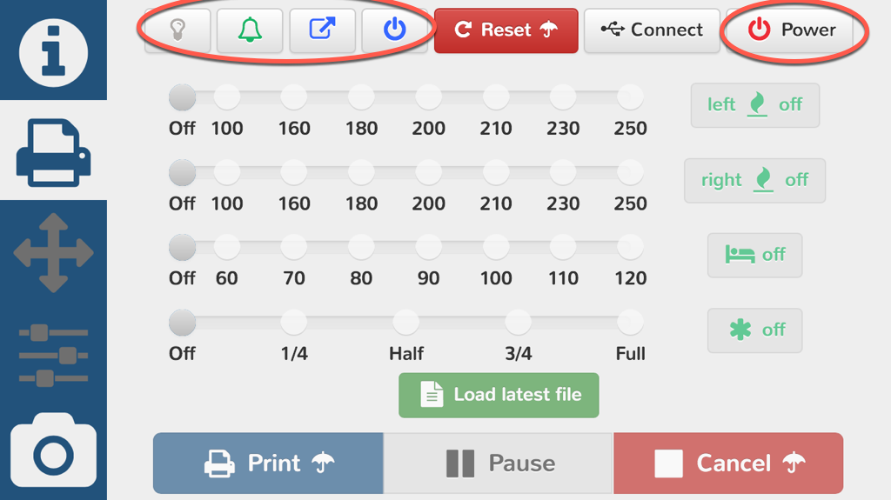

Add switch buttons for:
- switching printer on/off (confirm if currently printing)
- switch  IR LED ligths on/off
- mute alert sounds (M300 @)
- unload filament after printing finished (WIP)
- switch off printer after printing finished

Needs RPi.GPIO version greater than 0.6.0 to allow access to GPIO for non root and `chmod a+rw /dev/gpiomem`

Update on 12 Nov 2016:

Changed hardcoded values to config.yaml:

```
plugins:
  switch:
    led_pin: -1
    power_pin: -1
    reset_pin: -1
    command_power_off: M81
    extruders: 2
    retraction_length: 700
	retraction_speed: 600
	short_retraction_length: 10
```


- `led_pin` gpio where the printer LED light relay is connected
- `power_pin` gpio where the printer power relay is connected
- `reset_pin` gpio where the printer reset is connected (you can simulate a board switch push)
- `command_power_off` gcode to turn off printer 
- `extruders` number of extruders to unload filament from 
- `retraction_length` usefull manly for bowden extruders
- `retraction_speed` (self-explanatory)
- `short_retraction_length` extration when only power off but not unload is selected


using Nautilus



#More....

_This is part of a integrated solution to create a smooth 3D printing experience by "gluing" the individual software and hardware players_

