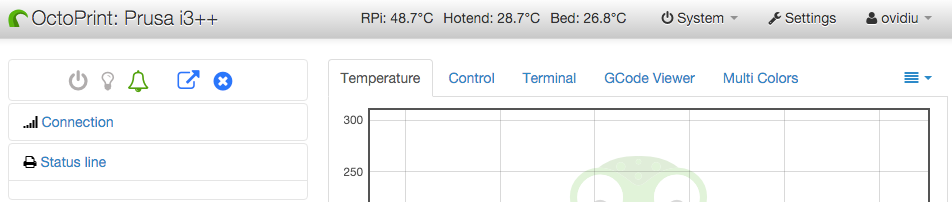

Add switch buttons for: 
- switching printer on/off printer (confirm if currently printing)
- switch  IR LED ligths on/off
- mute alert sounds (M300 @)
- unload filament after printing finished
- switch off printer after printing finished

Needs RPi.GPIO version greater than 0.6.0 to allow access to GPIO for non root and `chmod a+rw /dev/gpiomem`

